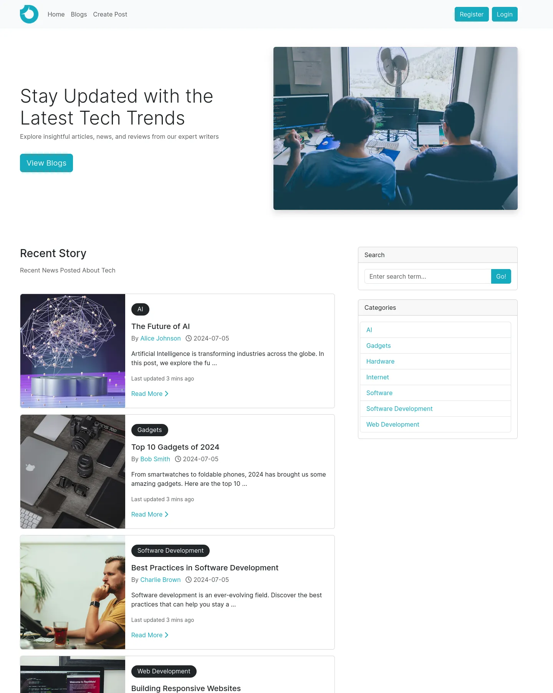
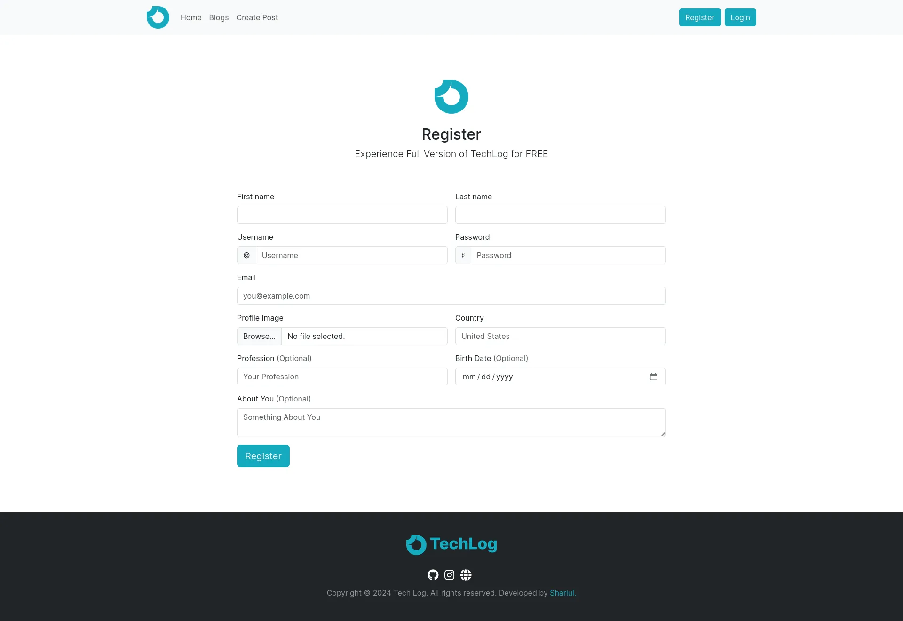

# Tech Log

A simple blog Website built with PHP and MySQL. User can create an account, login, and create blog posts for everyone to see. Users can also comment on posts. The website is responsive and works on all devices.

## Technologies Used

- PHP
- Composer
- MySQL
- HTML
- CSS
- JavaScript

## Features

- User authentication from scratch (register, login, logout)
- Create and manage blog posts
- Comment on blog posts
- Sort by categories and tags
- Responsive design for all devices
- Laravel like application architecture
- some features are still in development and will be added soon.

## Project Dependencies

- Windows, Linux, or MacOS
- PHP 7.4 or higher
- MySQL 5.7 or higher
- Composer 2.0 or higher
- A web server like Apache or Nginx
- Node.js and pnpm (for frontend dependencies)

## Run Locally

1. Clone the repository

```bash
git clone https://github.com/shariult/techlog-php.git
```

2. Change to the project directory

```bash
cd techlog-php
```

3. Install PHP dependencies using Composer

```bash
composer install
```

4. Install frontend dependencies using pnpm

```bash
pnpm install
```

5. Configure the "config/dbConfig.php" file and adjust the development url in the "index.php" file.

6. Change to the "public" directory,

```bash
cd public
```

7. Start the PHP built-in server

```bash
php -S localhost:8000
```

## 📬 Let's Connect & Collaborate!

I am currently open to freelance projects, remote positions, and collaborative opportunities.

[](https://shariul.com) [](https://www.linkedin.com/in/shariul/) [](https://discord.gg/9q5GRgVS2)

## Screenshots




